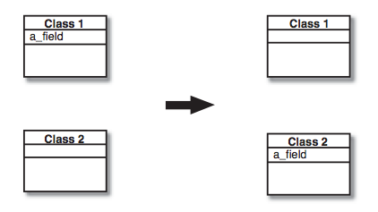

## Move Field
A field is, or will be, used by another class more than the class on which it is defined.

*Create a new attribute reader (and if necessary, a writer) in the target class, and change all its users.*

