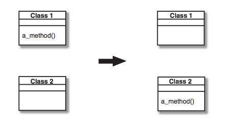

## Move Method
A method is, or will be, using or used by more features of another class than the class on which it is defined.

*Create a new method with a similar body in the class it uses most. Either turn the old method into a simple delegation, or remove it altogether.*

